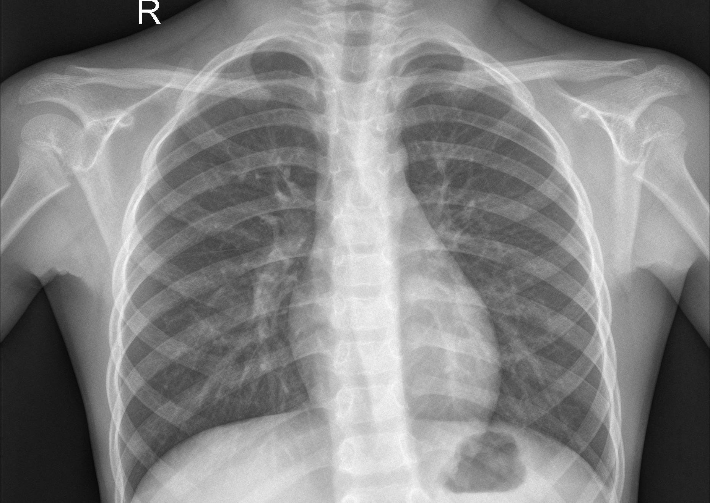
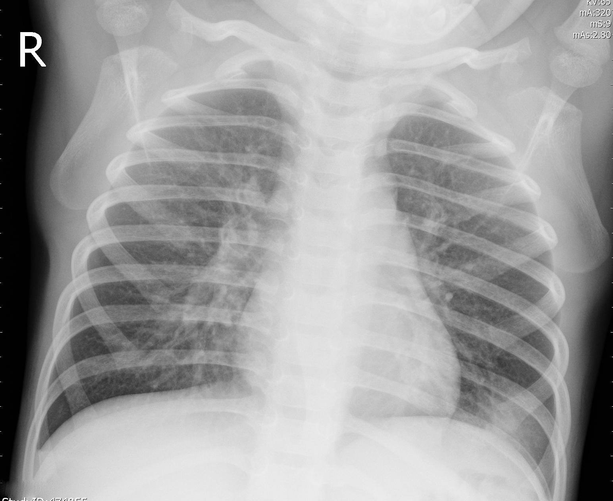
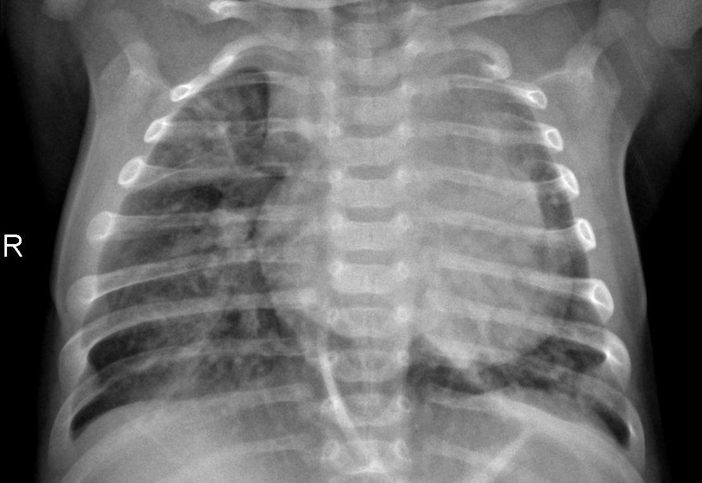
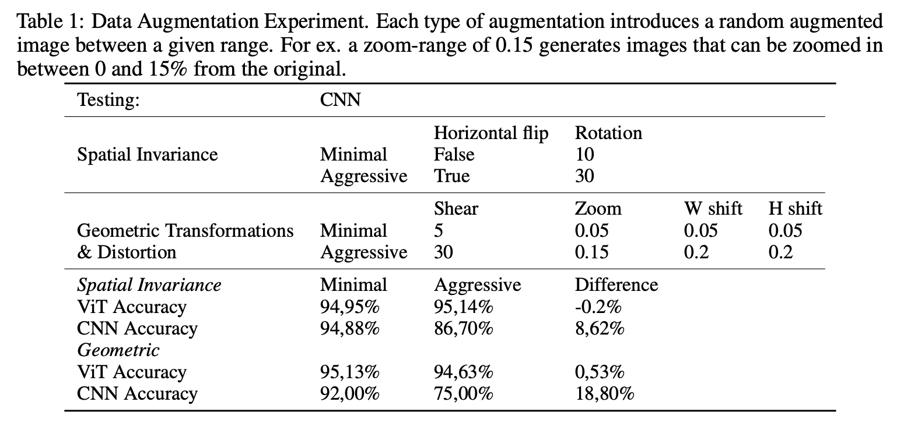
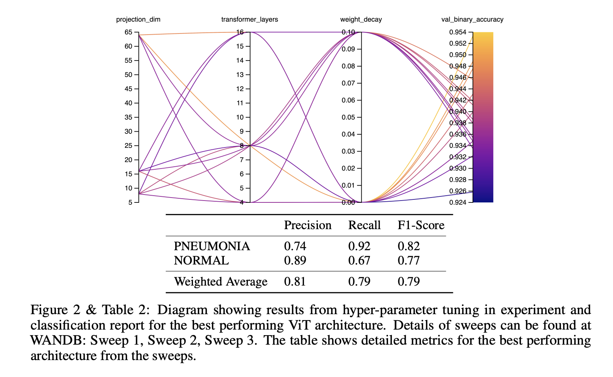

# Vision-Transformer-for-X-Ray-Pneumonia-Detection

## The project

The Visual Transformer (ViT), which involves the Transformer architecture, has recently been introduced as a viable alternative to the classical CNN to deal with computer vision problems. In this project, we create our own ViT in order to investigate the differences between the ViT and the CNN as well as to point out the potential advantages of using a ViT. For this, we consider a dataset consisting of binary-labeled chest X-ray images, where the X-rays are either standard or of a patient with pneumonia. Inspired by an open-source code implementation from Keras, our ViT is able to achieve a classification accuracy of 93.73%, compared to that of our baseline CNN accuracy of 91.19%. We also demonstrate that our ViT is less sensitive to aggressive data augmentation, as well as significantly reduces the time of training.

## Data

The second dataset consisted of 5,863 binary-labeled images of Chest X-Rays, described in D. Zhang K, "Identifying Medical Diagnoses and Treatable Diseases by Image-Based Deep Learning". The images consisted of exclusively one of two pneumonia diseases, bacterial and viral, both labeled PNEUMONIA, together with images labeled as NORMAL of healthy patients.

  
   
  

## Methods

The project was initially divided into three stages. The first stage was to demonstrate viable accuracy for the ViT. For this purpose, a ViT, as well as a CNN, was built. Secondly, the aim was to investigate and test the ViTs reaction to image data augmentation. Finally, the impact of different ViT specific hyperparameters was evaluated. For these purposes, a number of experiments were designed.

## ViT Hyperparameter Tuning

In this experiment, we wanted to investigate the sensitivity of the ViT to hyper-parameter tuning. In general, we could observe that higher accuracy was achieved when using low weight decay but that different combinations of transformer layers and projection dimensions achieved almost similar accuracy. In terms of sensitivity to changing different parameters, we could observe that the input dimension, projection dimension, and a number of transformer layers were most important. As displayed in table 3 we achieved our best accuracy with image-dimension 72 but as shown in section 5.4 compared to higher image dimension does not seem to have a significant effect on the accuracy of this particular data-set. However, when using lower image dimension during hyper-parameter tuning the running time was cut in half and the best accuracy was achieved at an earlier epoch. The ViT-architecture with the best validation binary accuracy was then tested on the test dataset consisting of 500 images. It demonstrated a validation F1-score of 91.8 % on the validation data and 79% on the test data. The lower F1-score on the test data is most likely due to slight overfitting because of the limited samples in the dataset (around 1000 samples for NORMAL).

## Conclusion

The results of this project clearly indicate that the ViT is a viable alternative when it comes to image classification in general and medical X-ray classification in particular. Considering a binary-labeled dataset of chest X-ray images, **our ViT achieved an accuracy of 93.79%, compared to our baseline CNN accuracy of 91.19%.**

Furthermore, **our ViT considerably reduced the training time, as much as five times**, required to achieve this result, indicating the promising potential of the ViT to reduce the computational resources required for image classification.

Moreover, our results suggest that the inherent **properties of the ViT make it considerably less sensitive to aggressive data augmentation** but we could not draw any general conclusions regarding the sensitivity to input image size. We also noticed limitations with the ViT. Our results on the dataset size indicated that the **ViT was to a larger extent in need of training data compared to our CNN** in order to reach optimal performance. Our initial efforts with the multi-labeled NIH dataset also indicated that the performance quickly degrades for more complex datasets and thus, on those occasions, may require pre-training as suggested by Dosovitskiy et al. (2020). Transformers for computer vision is a relatively new area that has exposed a hidden side of the transformer architecture.

Our results have confirmed that the ViT is indeed a viable alternative to CNN, as well as hinted at the potential advantages. The results of the ViT have not gone unnoticed and will surely be researched further within the computer vision community in the coming years.

Please read the full paper attatched in this repo for more information
